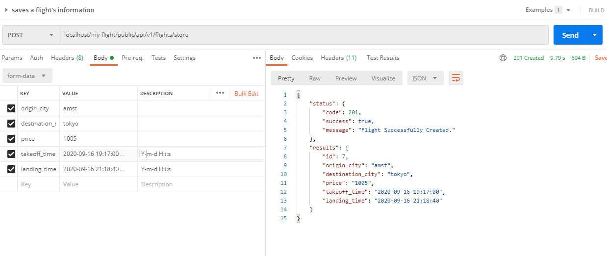
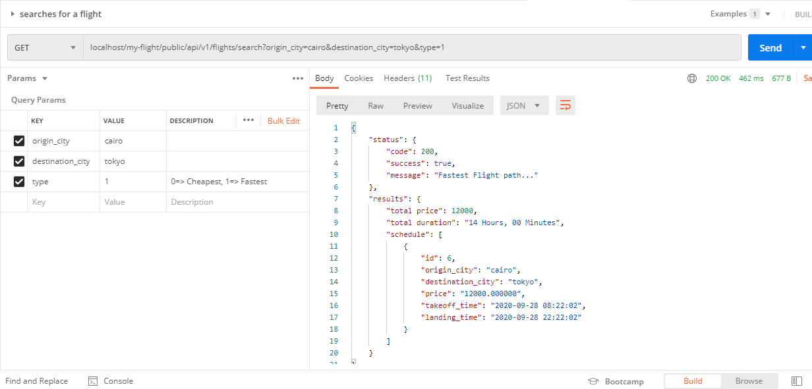
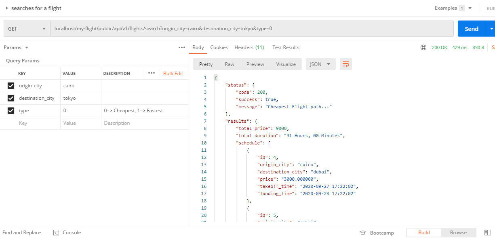

# 
 My Flights 

## about Project
#####  you can save the flight’s information such as  Origin city, Destination city, Price, Take-off time, Landing time.
##### Our target is to give the user an easy way to search and find the best flight option from one city to another.

## Quik Setup
##### if local host setup
### In your xammp/htdocs open terminal/CMD whatever you are use and make following statments.
#####    1- Run git clone https://github.com/ahmedtawfik74/my-flight.git
#####    2- Create a MySQL database for the project
#####    3- move .env example to .env
#####    4- in terminal run command=> composer install.
#####    5- open .env file and change DB configuration. 
#####    6- Import to it from DB/my_flights.sql file.
#####      or you can run command in terminal php artisan migrate
#####    7- in terminal run php artisan db:seed --class=FlightsTableDataSeeder.
#####    8- run php artisan cache:clear
#####    9- run php artisan config:clear
#####    10- run php artisan config:cache
#####    11- Congratulations -_-.
#####    12- if you prefer work with php artisan serve it's ok 
#####       from post man with method get => localhost:8000/api/v1/flights/search?origin_city=cairo&destination_city=atokyoa&type=1 
#####       else in xammp from post man with method get=> localhost/my-flight/public/api/v1/flights/search?origin_city=cairo&destination_city=atokyoa&type=1
#####
##### open post man and import collection =>
##### and don't forget url change url 
#####  https://www.postman.com/collections/344922bc9e2c95595db0
#####
##### if production setup
### In your host open SSH or clone project and archive it and upload archived file. whatever you are use and make following statments.
#####    1- Create a MySQL database for the project
#####    2- Import to it from DB/my_flights.sql file.
#####    3- open .env file and change DB configuration.
#####    4- rename my-flight\server.php to my-flight\index.php
#####    5- move my-flight\public\.htaccess  to my-flight\.htaccess
#####    6- run php artisan cache:clear
#####    7- run php artisan config:clear
#####    8- run php artisan config:cache
#####    9- Congratulations -_-.
#####    10- from post man with method get =>my-flight-or-your-name-in-host/api/v1/flights/search?origin_city=cairo&destination_city=atokyoa&type=1
#####
#####
#####
##### open post man and import collection =>
##### and don't forget url change url <a href="https://www.postman.com/collections/344922bc9e2c95595db0" target="_blank">Api Collection </a>

 <a href="https://www.postman.com/collections/344922bc9e2c95595db0" target="_blank">https://www.postman.com/collections/344922bc9e2c95595db0 </a>

#####   
##### 

 
 

#####  
#####  1. POST service that saves a flight’s information.
#####  Input:
#####    a. Origin city.
#####    b. Destination city.
#####    c. Price.
#####    d. Take-off time.
#####    e. Landing time
#####   
#####   output

 
 
 
 
#####    
##### 
#####    
##### 
##### GET service that searches for a flight and returns the best option. We can search for the
##### cheapest option or the fastest route option.
##### Input:
#####  a. Origin city.
#####  b. Destination city.
#####  c. Option type (0 for cheapest, 1 for fastest).
#####  Output: Flights schedule with the price and total duration
##### 
##### if fastest path type = 1

 
 
 
   

#####  if cheapest path type = 0

 
##### open post man and import collection =>https://www.postman.com/collections/344922bc9e2c95595db0
##### 

 
 
 
  
  
 ## Thank you.
